<!-- Banner -->

<p align="center">
  
</p>

<!-- Tech stack icons -->
<p align="center">
  
</p>

<!-- Metadata badges -->
<p align="center">
  
  &nbsp;
  
  &nbsp;
  
  &nbsp;
  
  &nbsp;
  
</p>

<br>

A cinematic Flutter productivity suite — glassmorphic dark UI, a hand-crafted 3D compass navigator, and Lottie · Rive · `flutter_animate` breathing life into every screen.

<br>

---

## 📥 Download

<p>
  <a href="https://github.com/NarendraM45/Nexus/releases/download/v1.0.0/nexus-final.apk">
    
  </a>
</p>

> Android 5.0+ (API 21) · Release-mode build · ARMv7 + ARM64 universal APK

---

## 🎬 Demo

<p align="center">
  
</p>

<p align="center">
  <a href="https://github.com/NarendraM45/Nexus/releases/download/v1.0.0/nexus-final.apk">
    
  </a>
</p>

---

## ✨ Features

| | Feature | Details |
|:---:|---|---|
| 🧭 | **3D Compass navigation** | Hand-crafted animated bottom nav with arc-precision icon math across 10 dynamic routes. Hides itself cleanly when overlays open via `navVisibleProvider` |
| ✨ | **Cinematic animations** | Lottie · Rive · `flutter_animate` on every screen — including a Lottie hamburger in every `AppBar` leading slot |
| 🪟 | **Glassmorphism** | Consistent dark glass cards, modals, and text fields with `BackdropFilter`, blur, and layered opacity |
| 📅 | **Calendar & tasks** | `table_calendar` with date-aware task creation sheets and `useRootNavigator: true` throughout all overlays |
| 👥 | **Team management** | Member cards with `CachedNetworkImage`, role editing, and a live avatar picker — camera · gallery · remove — with haptic feedback |
| 📊 | **Analytics** | `fl_chart` multi-chart dashboards with animated data entry transitions |
| 🗒️ | **Notes** | Masonry staggered grid via `flutter_staggered_grid_view` |
| 🔍 | **Explore** | Animated expanding search bar — 60% → 100% width on focus |
| 🎉 | **Confetti** | Burst effect on key milestone completions |
| 🔔 | **Notifications** | Local push notifications with runtime permission handling via `permission_handler` |

---

## 🗺 App Walkthrough

**Splash & Onboarding**  
The app opens with a cinematic 8-second animated splash — a pulsing purple hero Lottie plays center-screen over gently floating orbs, a typewriter subtitle fades in, and a mini rocket Lottie sits at the bottom. First-time users are routed to a 3-slide swipeable onboarding carousel with gradient overlays and smooth-page indicator dots. Returning users skip directly to the home screen.

**Authentication**  
Login and Signup are wrapped in a glassmorphic card that floats over a dolphin Lottie background. Both screens use `flutter_form_builder` with real-time validation, email/password autofill hints, and a shake animation triggered on invalid submit attempts. A success Lottie overlay celebrates a completed login before routing to the loading screen.

**Home Dashboard**  
A personalized greeting dynamically adapts to time-of-day (Good morning / afternoon / evening). Below sits a feature grid of quick-access tiles, a recent activity feed, and animated metric rings — all with staggered fade-in entry animations via `flutter_animate`.

**Navigation**  
A hand-crafted 3D Compass widget serves as the persistent bottom navigation bar with arc-geometry icon positioning across routes. Every screen also exposes a Lottie hamburger icon in its AppBar that slides open a full glassmorphic side drawer with the user avatar, profile stats, navigation links, and a one-tap Logout.

**Tasks & Calendar**  
Tasks are displayed as swipeable cards with priority color-coding, completion rings, and due-date chips. The Calendar tab integrates `table_calendar` with a bottom sheet for quick task creation from any selected date.

**Team**  
The Team screen shows a live member directory with online presence indicators (animated pulsing green dot), role chips, and `CachedNetworkImage` avatars with shimmer placeholders. Tapping a member opens a detail sheet with skills, task count, and contact info.

**Explore, Notes & Analytics**  
Explore features an animated search bar that expands from 60% to full width on focus. Notes uses a masonry staggered grid. The Analytics tab drives `fl_chart` bar and line charts with smooth animated data entry.

---

## 🛠 Tech stack

| Layer | Package | Version |
|---|---|---|
| Framework | `flutter` · Dart | `3.x` / `3.2+` |
| State management | `flutter_riverpod` | `2.5.1` |
| Navigation | `go_router` | `14.2.0` |
| Animations | `lottie` · `rive` · `flutter_animate` · `animations` | — |
| Charts | `fl_chart` | `0.69.2` |
| UI effects | `glassmorphism` · `blur` · `particle_field` · `shimmer` | — |
| Fonts | `google_fonts` (Orbitron) | `6.2.1` |
| Images | `cached_network_image` | `3.3.1` |
| Forms | `flutter_form_builder` + validators | `10.3.0` |
| Calendar | `table_calendar` | `3.1.2` |
| Storage | `shared_preferences` | `2.3.2` |
| Notifications | `flutter_local_notifications` | `17.2.2` |

---

## 🏗 Architecture

```
lib/
├── core/
│   ├── constants/     AppColors · AppTypography · AppStyles
│   ├── providers/     authProvider · taskProvider · notesProvider · avatarProvider
│   ├── router/        GoRouter declarative route config
│   ├── theme/         Light & dark theme data
│   └── utils/         AppLogger
├── features/
│   ├── splash/        Cinematic 8s animated splash
│   ├── onboarding/    3-slide swipeable feature walkthrough
│   ├── auth/          Glassmorphic Login · Signup with form_builder
│   ├── loading/       Post-auth rocket transition screen
│   ├── home/          Personalized greeting · activity summary
│   ├── calendar/      table_calendar + date-aware task sheets
│   ├── tasks/         Task CRUD + priority scheduling
│   ├── projects/      Project cards + staggered grid
│   ├── team/          Member cards + avatar picker + CachedNetworkImage
│   ├── analytics/     fl_chart multi-chart dashboards
│   ├── notes/         Masonry staggered grid notes
│   ├── activity/      Activity log feed
│   ├── explore/       Discover feed + animated expanding search
│   ├── profile/       Profile + photo editor
│   └── settings/      User preferences + app version
└── shared/
    ├── layouts/       CompassNavWidget · DrawerLayout · MainShell · RadialNavMenu
    └── widgets/
        ├── custom/    SafeLottie · RiveRefreshIndicator
        ├── buttons/   PrimaryButton · GradientButton
        ├── cards/     MediaCard · GlassCard
        ├── inputs/    GlassTextField · SearchBarWidget
        ├── breathing_list_item.dart
        └── lottie_hamburger.dart
```

State follows a strict **state class → notifier class → provider declaration** separation throughout. All navigation goes through `context.go()` / `context.push()` — no raw `Navigator` calls except inside `useRootNavigator: true` sheets.

---

## 🚀 Getting started

**Requirements** — Flutter 3.x · Dart 3.2+ · Android SDK 21+

```bash
# Clone
git clone https://github.com/NarendraM45/Nexus.git
cd Nexus

# Install dependencies
flutter pub get

# Run in debug mode
flutter run

# Build release APK
flutter build apk --release
# → build/app/outputs/flutter-apk/nexus-v1.0.0.apk
```

<details>
<summary>Generating launcher icons</summary>

Drop your icon at `assets/icon/icon.png` (1024×1024 recommended), then run:

```bash
dart run flutter_launcher_icons
```

</details>

---

## 📄 License

MIT © 2026 [NarendraM45](https://github.com/NarendraM45)

---

<p align="center">
  <sub>built with Flutter · powered by an unreasonable number of Lottie files · if this helped, drop a ⭐</sub>
</p>

<p align="center">
  
</p>
